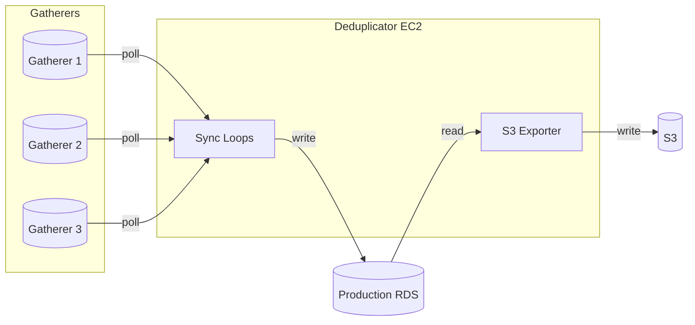
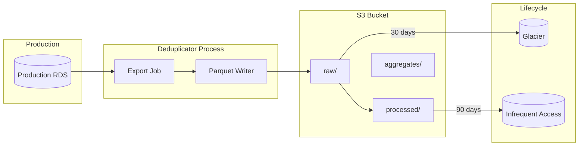
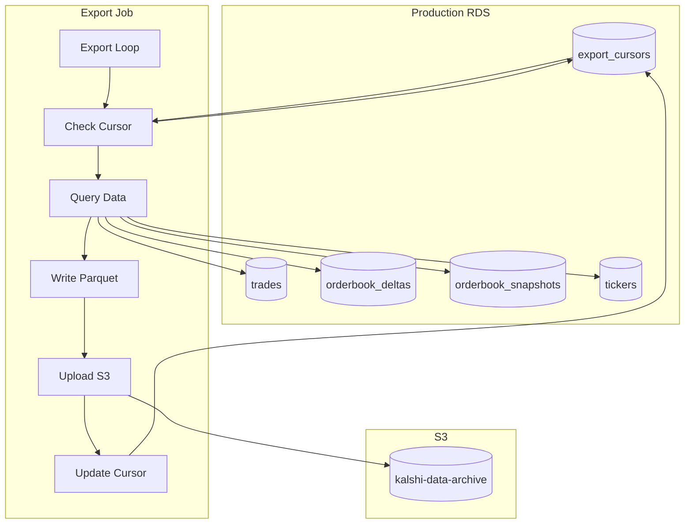
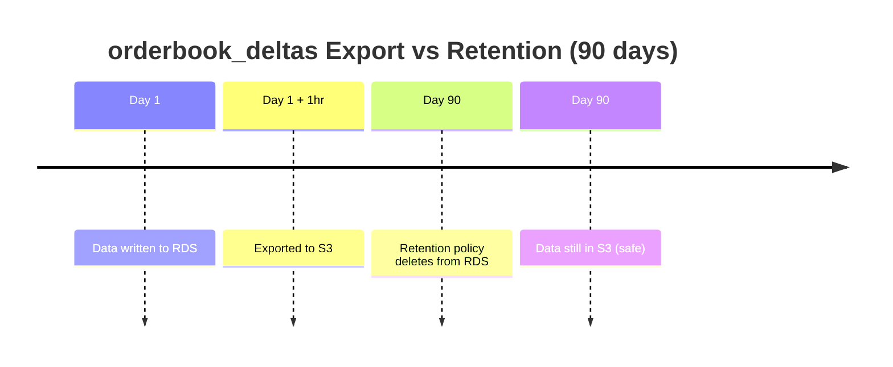

# S3 Export

Cold storage architecture, Parquet export, and lifecycle management.

---

## Overview

### Process Ownership

**S3 export runs as part of the deduplicator process** (not a separate cron job or Lambda):

| Component | Runs On | Responsibility |
|-----------|---------|----------------|
| S3 Exporter | Deduplicator EC2 | Export Production RDS → S3 |

**Why deduplicator owns S3 export:**
1. Already has Production RDS read access
2. Single writer avoids coordination complexity
3. Continuous process ensures timely exports
4. Shares IAM role with S3 write permissions



### Architecture



---

## Bucket Structure

```
s3://kalshi-data-archive/
├── raw/
│   ├── trades/
│   │   └── year=2024/month=01/day=15/
│   │       └── trades_2024-01-15_00-00-00.parquet
│   ├── orderbook_deltas/
│   │   └── year=2024/month=01/day=15/hour=10/
│   │       └── deltas_2024-01-15_10-00-00.parquet
│   ├── orderbook_snapshots/
│   │   └── year=2024/month=01/day=15/
│   │       └── snapshots_2024-01-15.parquet
│   └── tickers/
│       └── year=2024/month=01/day=15/hour=10/
│           └── tickers_2024-01-15_10-00-00.parquet
├── processed/
│   ├── trades/
│   ├── orderbook_snapshots/
│   └── market_activity/
└── aggregates/
    ├── daily_volume/
    ├── hourly_ohlc/
    └── market_stats/
```

### Prefix Descriptions

| Prefix | Content | Format | Retention |
|--------|---------|--------|-----------|
| `raw/` | Unprocessed exports from RDS | Parquet | Glacier after 30 days |
| `processed/` | Cleaned, validated, enriched | Parquet | IA after 90 days |
| `aggregates/` | Pre-computed analytics | Parquet | Standard |

---

## Parquet Schema

### trades

```
message trades {
  required binary trade_id (STRING);
  required int64 exchange_ts;
  required int64 received_at;
  required binary ticker (STRING);
  required int32 price;
  required int32 size;
  required boolean taker_side;
  optional int64 sid;
}
```

### orderbook_deltas

```
message orderbook_deltas {
  required int64 exchange_ts;
  required int64 received_at;
  required int64 seq;
  required binary ticker (STRING);
  required boolean side;
  required int32 price;
  required int32 size_delta;
  optional int64 sid;
}
```

### orderbook_snapshots

```
message orderbook_snapshots {
  required int64 snapshot_ts;
  optional int64 exchange_ts;
  required binary ticker (STRING);
  required binary source (STRING);
  required binary yes_bids (JSON);
  required binary yes_asks (JSON);
  required binary no_bids (JSON);
  required binary no_asks (JSON);
  optional int32 best_yes_bid;
  optional int32 best_yes_ask;
  optional int32 spread;
  optional int64 sid;
}
```

### tickers

```
message tickers {
  required int64 exchange_ts;
  required int64 received_at;
  required binary ticker (STRING);
  optional int32 yes_bid;
  optional int32 yes_ask;
  optional int32 last_price;
  optional int64 volume;
  optional int64 open_interest;
  optional int64 dollar_volume;
  optional int64 dollar_open_interest;
  optional int64 sid;
}
```

---

## Export Jobs

### Schedule

| Table | Frequency | Lag | File Size |
|-------|-----------|-----|-----------|
| trades | Hourly | 1 hour | ~5 MB |
| orderbook_deltas | Hourly | 1 hour | ~30 MB |
| orderbook_snapshots | Daily | 1 day | ~150 MB |
| tickers | Hourly | 1 hour | ~3 MB |

### Export Query

```sql
-- Export trades for a time range
COPY (
    SELECT
        trade_id,
        exchange_ts,
        received_at,
        ticker,
        price,
        size,
        taker_side
    FROM trades
    WHERE exchange_ts >= $start_ts
      AND exchange_ts < $end_ts
    ORDER BY exchange_ts
) TO STDOUT WITH (FORMAT 'csv', HEADER);
```

### Export Job Configuration

```go
type ExportConfig struct {
    Table         string
    Frequency     time.Duration
    Lag           time.Duration
    PartitionBy   []string       // ["year", "month", "day"]
    MaxFileSize   int64          // Target file size
    Compression   string         // "snappy", "gzip", "zstd"
}

var ExportConfigs = map[string]ExportConfig{
    "trades": {
        Table:       "trades",
        Frequency:   1 * time.Hour,
        Lag:         1 * time.Hour,
        PartitionBy: []string{"year", "month", "day"},
        Compression: "snappy",
    },
    "orderbook_deltas": {
        Table:       "orderbook_deltas",
        Frequency:   1 * time.Hour,
        Lag:         1 * time.Hour,
        PartitionBy: []string{"year", "month", "day", "hour"},
        Compression: "snappy",
    },
}
```

---

## Lifecycle Policies

### Bucket Policy

```json
{
  "Rules": [
    {
      "ID": "RawToGlacier",
      "Filter": { "Prefix": "raw/" },
      "Status": "Enabled",
      "Transitions": [
        {
          "Days": 30,
          "StorageClass": "GLACIER"
        }
      ]
    },
    {
      "ID": "ProcessedToIA",
      "Filter": { "Prefix": "processed/" },
      "Status": "Enabled",
      "Transitions": [
        {
          "Days": 90,
          "StorageClass": "STANDARD_IA"
        }
      ]
    },
    {
      "ID": "DeleteOldRaw",
      "Filter": { "Prefix": "raw/" },
      "Status": "Enabled",
      "Expiration": {
        "Days": 365
      }
    }
  ]
}
```

### Storage Classes

| Class | Use Case | Retrieval |
|-------|----------|-----------|
| Standard | Recent data, frequent access | Immediate |
| Standard-IA | Older data, occasional access | Immediate |
| Glacier | Archive, rare access | 3-5 hours |
| Glacier Deep Archive | Compliance, very rare | 12 hours |

---

## Querying S3 Data

### AWS Athena

Create external tables for SQL queries.

```sql
-- Create Athena table for trades
CREATE EXTERNAL TABLE trades (
    trade_id STRING,
    exchange_ts BIGINT,
    received_at BIGINT,
    ticker STRING,
    price INT,
    size INT,
    taker_side BOOLEAN
)
PARTITIONED BY (year STRING, month STRING, day STRING)
STORED AS PARQUET
LOCATION 's3://kalshi-data-archive/raw/trades/'
TBLPROPERTIES ('parquet.compression'='SNAPPY');

-- Load partitions
MSCK REPAIR TABLE trades;

-- Query
SELECT ticker, COUNT(*), SUM(size) as volume
FROM trades
WHERE year = '2024' AND month = '01'
GROUP BY ticker
ORDER BY volume DESC
LIMIT 100;
```

### Spark

```python
from pyspark.sql import SparkSession

spark = SparkSession.builder \
    .appName("KalshiAnalytics") \
    .getOrCreate()

# Read trades
trades = spark.read.parquet("s3://kalshi-data-archive/raw/trades/")

# Filter and aggregate
daily_volume = trades \
    .filter(trades.exchange_ts >= start_ts) \
    .groupBy("ticker") \
    .agg({"size": "sum", "trade_id": "count"})

daily_volume.show()
```

### DuckDB

```sql
-- Direct S3 query with DuckDB
INSTALL httpfs;
LOAD httpfs;

SET s3_region='us-east-1';
SET s3_access_key_id='...';
SET s3_secret_access_key='...';

SELECT ticker, COUNT(*), SUM(size)
FROM read_parquet('s3://kalshi-data-archive/raw/trades/year=2024/month=01/day=15/*.parquet')
GROUP BY ticker;
```

---

## Export Pipeline

### Pipeline Architecture



### Export Job Loop

```go
func (e *S3Exporter) Run(ctx context.Context) {
    for _, table := range e.tables {
        ticker := time.NewTicker(e.configs[table].Frequency)
        defer ticker.Stop()

        go func(table string) {
            for {
                select {
                case <-ctx.Done():
                    return
                case <-ticker.C:
                    if err := e.exportBatch(ctx, table); err != nil {
                        e.logger.Error("export failed",
                            "table", table,
                            "err", err,
                        )
                        e.metrics.ExportErrors.WithLabelValues(table).Inc()
                    }
                }
            }
        }(table)
    }
}

func (e *S3Exporter) exportBatch(ctx context.Context, table string) error {
    config := e.configs[table]

    // Get cursor (last exported timestamp)
    cursor, err := e.getCursor(ctx, table)
    if err != nil {
        return fmt.Errorf("get cursor: %w", err)
    }

    // Calculate export window
    now := time.Now()
    endTs := now.Add(-config.Lag).UnixMicro()

    // Don't export if nothing new
    if cursor >= endTs {
        return nil
    }

    // Export in batches to avoid OOM
    for cursor < endTs {
        batchEnd := min(cursor+config.BatchSize, endTs)

        if err := e.exportRange(ctx, table, cursor, batchEnd); err != nil {
            return fmt.Errorf("export range: %w", err)
        }

        cursor = batchEnd
    }

    return nil
}
```

### Coordination with Retention Policies

**Critical:** Export must complete BEFORE retention policies delete data.

| Table | Export Frequency | Export Lag | Retention | Safety Margin |
|-------|-----------------|------------|-----------|---------------|
| trades | 1 hour | 1 hour | Forever | ∞ |
| orderbook_deltas | 1 hour | 1 hour | 90 days | 89 days 22 hours |
| orderbook_snapshots | 1 day | 1 day | Forever | ∞ |
| tickers | 1 hour | 1 hour | 30 days | 29 days 22 hours |



### Failure Recovery

**Scenario: Export fails for multiple hours**

```go
func (e *S3Exporter) exportBatch(ctx context.Context, table string) error {
    // ... export logic ...

    // Check if we're approaching retention boundary
    config := e.configs[table]
    cursor, _ := e.getCursor(ctx, table)
    lag := time.Since(time.UnixMicro(cursor))

    if config.Retention > 0 && lag > config.Retention-24*time.Hour {
        e.logger.Error("CRITICAL: export lag approaching retention boundary",
            "table", table,
            "lag", lag,
            "retention", config.Retention,
        )
        e.metrics.ExportCritical.WithLabelValues(table).Inc()
        // Alert: ExportRetentionConflict
    }
}
```

**Alert thresholds:**

| Lag | Severity | For 90-day Retention |
|-----|----------|---------------------|
| < 2 hours | Normal | - |
| 2-24 hours | Warning | Investigate |
| > 24 hours | Critical | Immediate action |
| > 7 days | Emergency | Risk of data loss |

### Atomicity

Export cursor update is atomic with S3 upload confirmation:

```go
func (e *S3Exporter) exportRange(ctx context.Context, table string, start, end int64) error {
    // 1. Query and write Parquet to temp file
    tempFile, err := e.writeParquet(ctx, table, start, end)
    if err != nil {
        return err
    }
    defer os.Remove(tempFile)

    // 2. Upload to S3 (retries internally)
    key := e.s3Key(table, start)
    if err := e.uploadWithRetry(ctx, tempFile, key); err != nil {
        return err  // Don't update cursor on S3 failure
    }

    // 3. Update cursor only AFTER successful S3 upload
    if err := e.updateCursor(ctx, table, end); err != nil {
        // S3 file exists but cursor not updated
        // Next run will re-export (idempotent - same file overwritten)
        return err
    }

    e.metrics.ExportSuccess.WithLabelValues(table).Inc()
    e.metrics.ExportedRows.WithLabelValues(table).Add(float64(e.lastBatchRows))
    return nil
}
```

**Failure modes:**

| Failure Point | Cursor State | S3 State | Recovery |
|---------------|--------------|----------|----------|
| Before S3 upload | Old | No file | Re-export same range |
| During S3 upload | Old | Partial | Re-upload (overwrites) |
| S3 success, cursor fails | Old | Complete | Re-export (overwrites) |
| Both succeed | Updated | Complete | Normal |

---

## Export Implementation

### Go Exporter

```go
type S3Exporter struct {
    db       *pgxpool.Pool
    s3Client *s3.Client
    bucket   string
}

func (e *S3Exporter) ExportTable(ctx context.Context, table string, start, end int64) error {
    // Query data
    rows, err := e.db.Query(ctx, exportQuery(table), start, end)
    if err != nil {
        return err
    }
    defer rows.Close()

    // Write to Parquet buffer
    buf := new(bytes.Buffer)
    pw := parquet.NewWriter(buf, schema(table))

    for rows.Next() {
        record := scanRow(rows)
        pw.Write(record)
    }
    pw.Close()

    // Upload to S3
    key := fmt.Sprintf("raw/%s/%s", table, partitionPath(start))
    _, err = e.s3Client.PutObject(ctx, &s3.PutObjectInput{
        Bucket: aws.String(e.bucket),
        Key:    aws.String(key),
        Body:   buf,
    })
    return err
}
```

### Cursor Management

Track export progress to avoid duplicates.

```sql
CREATE TABLE export_cursors (
    table_name      VARCHAR(64) PRIMARY KEY,
    last_export_ts  BIGINT NOT NULL,
    last_export_at  TIMESTAMPTZ DEFAULT NOW()
);

-- Update after successful export
UPDATE export_cursors
SET last_export_ts = $1, last_export_at = NOW()
WHERE table_name = $2;
```

---

## Validation

### Row Counts

```sql
-- Compare RDS and S3 counts
-- RDS
SELECT COUNT(*) FROM trades
WHERE exchange_ts >= $start AND exchange_ts < $end;

-- Athena
SELECT COUNT(*) FROM trades
WHERE year = '2024' AND month = '01' AND day = '15';
```

### Checksums

```python
# Compute checksum for validation
import hashlib

def compute_checksum(parquet_path):
    df = pd.read_parquet(parquet_path)
    # Sort for consistent ordering
    df = df.sort_values(['exchange_ts', 'trade_id'])
    return hashlib.md5(df.to_json().encode()).hexdigest()
```

---

## Cost Optimization

### Storage Costs

| Class | Cost/GB/Month | 1 TB/Month |
|-------|---------------|------------|
| Standard | $0.023 | $23.55 |
| Standard-IA | $0.0125 | $12.80 |
| Glacier | $0.004 | $4.10 |
| Glacier Deep | $0.00099 | $1.01 |

### Optimization Strategies

| Strategy | Savings |
|----------|---------|
| Lifecycle to Glacier | 80% after 30 days |
| Snappy compression | 50% size reduction |
| Partition pruning | Reduce scan costs |
| Delete old raw after processed | 100% |

### Estimated Monthly Cost

| Data | Storage Class | Size | Cost |
|------|---------------|------|------|
| Recent raw (30 days) | Standard | 10 GB | $0.23 |
| Older raw (1 year) | Glacier | 100 GB | $0.40 |
| Processed (90 days) | Standard | 30 GB | $0.69 |
| Processed (older) | IA | 200 GB | $2.50 |
| Aggregates | Standard | 5 GB | $0.12 |
| **Total** | | **345 GB** | **~$4/month** |

---

## Monitoring

### Export Metrics

| Metric | Type | Description |
|--------|------|-------------|
| `export_rows_total` | Counter | Rows exported |
| `export_bytes_total` | Counter | Bytes written to S3 |
| `export_duration_seconds` | Histogram | Export job duration |
| `export_errors_total` | Counter | Failed exports |
| `export_lag_seconds` | Gauge | Time since last export |

### Alerts

| Condition | Threshold | Severity |
|-----------|-----------|----------|
| Export lag | > 2 hours | Warning |
| Export lag | > 6 hours | Critical |
| Export errors | > 3 consecutive | Warning |
| S3 upload failure | Any | Warning |

---

## Recovery

### Re-export from RDS

If S3 data is lost or corrupted:

```bash
# Re-export specific time range
./exporter --table trades \
  --start "2024-01-15T00:00:00Z" \
  --end "2024-01-16T00:00:00Z" \
  --force
```

### Restore Glacier Data

```bash
# Initiate restore (expedited: 1-5 min, standard: 3-5 hours)
aws s3api restore-object \
  --bucket kalshi-data-archive \
  --key raw/trades/year=2024/month=01/day=01/trades.parquet \
  --restore-request '{"Days":7,"GlacierJobParameters":{"Tier":"Standard"}}'

# Check restore status
aws s3api head-object \
  --bucket kalshi-data-archive \
  --key raw/trades/year=2024/month=01/day=01/trades.parquet
```

---

## Error Handling

### Error Categories

| Error Type | Retry | Alert | Data Loss Risk |
|------------|-------|-------|----------------|
| RDS query timeout | Yes (3x) | After 3 failures | None (cursor not updated) |
| S3 upload failure | Yes (5x with backoff) | After 5 failures | None (cursor not updated) |
| Parquet write error | No | Immediate | None (local temp file) |
| Cursor update failure | Yes (3x) | After 3 failures | Low (re-export overwrites) |
| Export lag > 24h | N/A | Warning | Medium (approaching retention) |
| Export lag > 7d | N/A | Critical | High (data loss imminent) |

### Retry Logic

```go
func (e *S3Exporter) uploadWithRetry(ctx context.Context, file, key string) error {
    var lastErr error
    for attempt := 1; attempt <= 5; attempt++ {
        err := e.upload(ctx, file, key)
        if err == nil {
            return nil
        }
        lastErr = err

        // Exponential backoff: 1s, 2s, 4s, 8s, 16s
        backoff := time.Duration(1<<uint(attempt-1)) * time.Second
        e.logger.Warn("S3 upload failed, retrying",
            "attempt", attempt,
            "backoff", backoff,
            "error", err,
        )
        e.metrics.UploadRetries.WithLabelValues(key).Inc()

        select {
        case <-ctx.Done():
            return ctx.Err()
        case <-time.After(backoff):
        }
    }
    return fmt.Errorf("upload failed after 5 attempts: %w", lastErr)
}
```

### Circuit Breaker

Prevent cascading failures when S3 or RDS is unhealthy:

```go
type ExportCircuitBreaker struct {
    failures     int
    threshold    int           // Open after N failures
    resetAfter   time.Duration // Reset after duration
    lastFailure  time.Time
    state        string        // "closed", "open", "half-open"
}

func (cb *ExportCircuitBreaker) Allow() bool {
    if cb.state == "closed" {
        return true
    }
    if cb.state == "open" && time.Since(cb.lastFailure) > cb.resetAfter {
        cb.state = "half-open"
        return true  // Allow one attempt
    }
    return cb.state == "half-open"
}

func (cb *ExportCircuitBreaker) RecordSuccess() {
    cb.failures = 0
    cb.state = "closed"
}

func (cb *ExportCircuitBreaker) RecordFailure() {
    cb.failures++
    cb.lastFailure = time.Now()
    if cb.failures >= cb.threshold {
        cb.state = "open"
    }
}
```

### Manual Intervention Procedures

#### Export Lag > 24 hours

```bash
# 1. Check deduplicator health
curl http://deduplicator:8080/health

# 2. Check export metrics
curl -s http://deduplicator:9090/metrics | grep export_lag

# 3. Check for errors in logs
journalctl -u deduplicator --since "24 hours ago" | grep -i export

# 4. If RDS is healthy, manually trigger catchup
./deduplicator export --table orderbook_deltas --catchup

# 5. Monitor lag reduction
watch -n 10 'curl -s http://deduplicator:9090/metrics | grep export_lag'
```

#### Export Lag > 7 days (Emergency)

**CRITICAL:** Data loss imminent for tables with retention policies.

```bash
# 1. IMMEDIATELY extend retention on affected tables
psql -h $RDS_HOST -d kalshi_prod -c "
  SELECT remove_retention_policy('orderbook_deltas');
  SELECT remove_retention_policy('tickers');
"

# 2. Investigate root cause
#    - S3 access denied? Check IAM role
#    - RDS overloaded? Check connections, queries
#    - Disk full on deduplicator? Check /var/lib/kalshi

# 3. Fix root cause

# 4. Run full catchup
./deduplicator export --table orderbook_deltas --catchup --batch-size 100000

# 5. Verify no gaps
./exporter verify --table orderbook_deltas \
  --start "$(date -d '90 days ago' +%Y-%m-%d)" \
  --end "$(date +%Y-%m-%d)"

# 6. Re-enable retention (only after export is caught up!)
psql -h $RDS_HOST -d kalshi_prod -c "
  SELECT add_retention_policy('orderbook_deltas', INTERVAL '90 days');
  SELECT add_retention_policy('tickers', INTERVAL '30 days');
"
```

#### S3 Upload Failures

```bash
# 1. Test S3 connectivity
aws s3 ls s3://kalshi-data-archive/raw/ --max-items 1

# 2. Check IAM permissions
aws sts get-caller-identity
aws s3api get-bucket-policy --bucket kalshi-data-archive

# 3. Check bucket exists and is accessible
aws s3api head-bucket --bucket kalshi-data-archive

# 4. If permission issue, verify IAM role attached to EC2
curl http://169.254.169.254/latest/meta-data/iam/security-credentials/

# 5. Test write permission
echo "test" | aws s3 cp - s3://kalshi-data-archive/test.txt
aws s3 rm s3://kalshi-data-archive/test.txt
```

### Health Check Integration

S3 export status is included in deduplicator health:

```json
{
  "status": "degraded",
  "components": {
    "production_rds": "connected",
    "gatherers": { ... },
    "sync": { ... },
    "s3_export": {
      "status": "degraded",
      "tables": {
        "trades": {"lag_seconds": 3600, "last_success": "2024-01-15T10:00:00Z"},
        "orderbook_deltas": {"lag_seconds": 7200, "last_success": "2024-01-15T09:00:00Z"},
        "tickers": {"lag_seconds": 3600, "last_success": "2024-01-15T10:00:00Z"}
      },
      "errors_last_hour": 3
    }
  }
}
```

| Export Status | Criteria |
|---------------|----------|
| `healthy` | All tables: lag < 2 hours, no errors in last hour |
| `degraded` | Any table: lag 2-24 hours, or errors in last hour |
| `unhealthy` | Any table: lag > 24 hours, or > 10 consecutive errors |
