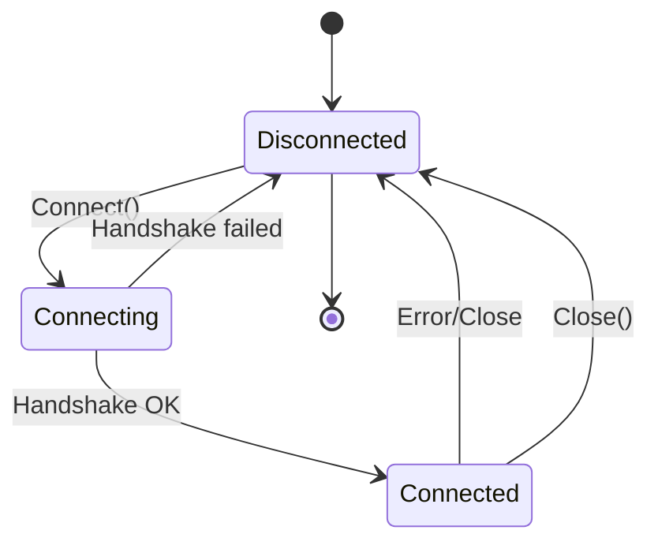
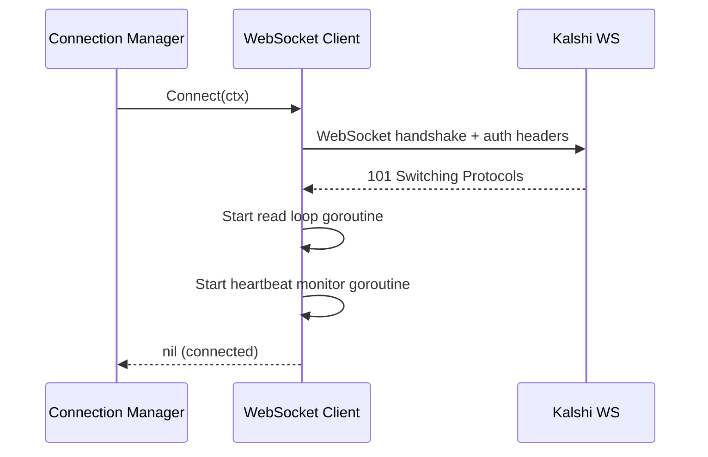
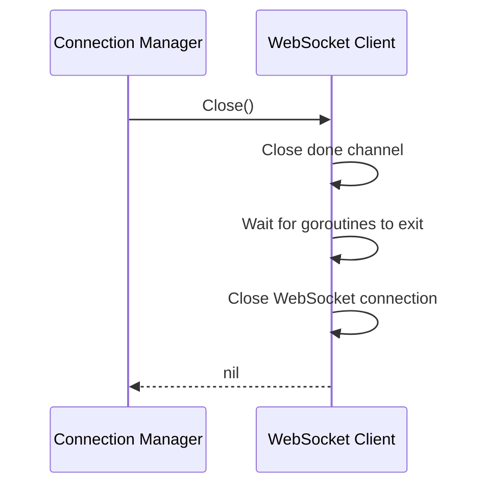

# Lifecycle

Connection states and sequences for WebSocket Client.

---

## State Machine



---

## Connect Sequence



---

## Authentication

API key included as header during WebSocket handshake:

```go
func (c *client) Connect(ctx context.Context) error {
    headers := http.Header{
        "Authorization": []string{fmt.Sprintf("Bearer %s", c.cfg.APIKey)},
    }

    conn, _, err := websocket.DefaultDialer.DialContext(ctx, c.cfg.URL, headers)
    if err != nil {
        return fmt.Errorf("dial failed: %w", err)
    }

    c.conn = conn
    c.connected = true
    c.lastPingAt = time.Now() // Initialize to avoid immediate stale detection

    go c.readLoop()
    go c.heartbeatLoop()

    return nil
}
```

---

## Close Sequence



```go
func (c *client) Close() error {
    c.mu.Lock()
    if !c.connected {
        c.mu.Unlock()
        return nil
    }
    c.connected = false
    c.mu.Unlock()

    // Signal goroutines to stop
    close(c.done)

    // Set read deadline to unblock ReadMessage immediately
    c.conn.SetReadDeadline(time.Now())

    // Close the underlying connection
    return c.conn.Close()
}
```

**Notes**:
- Client does NOT attempt reconnection. That's Connection Manager's job.
- `SetReadDeadline` unblocks `ReadMessage` so readLoop exits cleanly.
- Read errors after `done` is closed are ignored (see behaviors.md).
