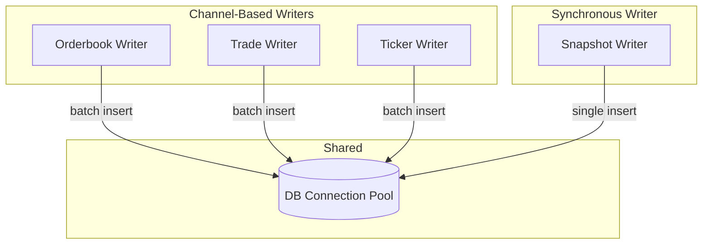

# Interface

Public methods and types for Writers.

---

## Writer Interface

```go
type Writer interface {
    // Start begins consuming from input channel and writing to DB
    Start(ctx context.Context) error

    // Stop gracefully shuts down the writer
    Stop(ctx context.Context) error
}
```

---

## Writer Implementations

### Orderbook Writer

Handles both WebSocket snapshots and deltas.

```go
type OrderbookWriter struct {
    cfg     WriterConfig
    ctx     context.Context
    cancel  context.CancelFunc
    wg      sync.WaitGroup
    logger  *slog.Logger

    // Input from Message Router
    input <-chan OrderbookMsg

    // Database
    db *pgxpool.Pool

    // Batching
    deltaBatch    []orderbookDeltaRow
    snapshotBatch []orderbookSnapshotRow
    flushTicker   *time.Ticker

    // Metrics
    metrics *WriterMetrics
}
```

### Trade Writer

```go
type TradeWriter struct {
    cfg     WriterConfig
    ctx     context.Context
    cancel  context.CancelFunc
    wg      sync.WaitGroup
    logger  *slog.Logger

    // Input from Message Router
    input <-chan TradeMsg

    // Database
    db *pgxpool.Pool

    // Batching
    batch       []tradeRow
    flushTicker *time.Ticker

    // Metrics
    metrics *WriterMetrics
}
```

### Ticker Writer

```go
type TickerWriter struct {
    cfg     WriterConfig
    ctx     context.Context
    cancel  context.CancelFunc
    wg      sync.WaitGroup
    logger  *slog.Logger

    // Input from Message Router
    input <-chan TickerMsg

    // Database
    db *pgxpool.Pool

    // Batching
    batch       []tickerRow
    flushTicker *time.Ticker

    // Metrics
    metrics *WriterMetrics
}
```

### Snapshot Writer

Handles REST API snapshots from Snapshot Poller. Unlike channel-based writers, Snapshot Writer is synchronous.

```go
type SnapshotWriter struct {
    cfg     WriterConfig
    ctx     context.Context
    logger  *slog.Logger

    // Database
    db *pgxpool.Pool

    // Metrics
    metrics *WriterMetrics

    // Note: No wg, cancel, or flushTicker - writes are synchronous
    // Snapshot Poller calls Write() directly and blocks until complete
}

// Called by Snapshot Poller for each market
func (w *SnapshotWriter) Write(snapshot RESTOrderbookSnapshot) error
```

---

## Input Types

From Message Router (see [message-router/interface.md](../message-router/interface.md)):

### OrderbookMsg

```go
type OrderbookMsg struct {
    Type string  // "snapshot" or "delta"

    // Common fields
    Ticker     string
    SID        int64
    Seq        int64
    ReceivedAt time.Time
    SeqGap     bool
    GapSize    int

    // Snapshot-only fields (empty for delta)
    Yes []PriceLevel
    No  []PriceLevel

    // Delta-only fields (zero/empty for snapshot)
    PriceDollars string  // e.g. "0.52" or "0.5250"
    Delta        int
    Side         string  // "yes" or "no"
    ExchangeTs   int64   // Microseconds
}

type PriceLevel struct {
    Dollars  string  // e.g. "0.52", "0.5250"
    Quantity int
}
```

### TradeMsg

```go
type TradeMsg struct {
    Ticker          string
    TradeID         string
    Size            int     // Number of contracts
    YesPriceDollars string  // e.g. "0.52"
    NoPriceDollars  string  // e.g. "0.48"
    TakerSide       string  // "yes" or "no"
    SID             int64
    Seq             int64
    ExchangeTs      int64   // Microseconds
    ReceivedAt      time.Time
}
```

### TickerMsg

```go
type TickerMsg struct {
    Ticker             string
    PriceDollars       string  // Last price
    YesBidDollars      string
    YesAskDollars      string
    NoBidDollars       string  // Received from API but not stored (derivable: 100000 - YesBid)
    Volume             int64
    OpenInterest       int64
    DollarVolume       int64
    DollarOpenInterest int64
    SID                int64
    ExchangeTs         int64   // Microseconds
    ReceivedAt         time.Time
}
```

### RESTOrderbookSnapshot

From Snapshot Poller (REST API). Note: REST API also provides bids only, so asks are derived.

```go
type RESTOrderbookSnapshot struct {
    Ticker     string
    SnapshotTs int64  // When poller fetched (µs)

    // Kalshi API provides bids only per side
    // Asks are derived: YES bid at X = NO ask at (100000 - X)
    YesBids []PriceLevel
    NoBids  []PriceLevel
}
```

---

## Database Row Types

### tradeRow

```go
type tradeRow struct {
    TradeID    string  // UUID
    ExchangeTs int64   // Microseconds
    ReceivedAt int64   // Microseconds
    Ticker     string
    Price      int     // Hundred-thousandths (0-100,000)
    Size       int
    TakerSide  bool    // TRUE = yes, FALSE = no
    SID        int64   // Subscription ID
}
```

### orderbookDeltaRow

```go
type orderbookDeltaRow struct {
    ExchangeTs int64
    ReceivedAt int64
    Seq        int64
    Ticker     string
    Side       bool    // TRUE = yes, FALSE = no
    Price      int     // Hundred-thousandths
    SizeDelta  int     // Positive = add, negative = remove
    SID        int64   // Subscription ID
}
```

### orderbookSnapshotRow

```go
type orderbookSnapshotRow struct {
    SnapshotTs  int64
    ExchangeTs  int64   // 0 for WS/REST snapshots
    Ticker      string
    Source      string  // "ws" or "rest"
    YesBids     []byte  // JSONB: [{price: int, size: int}, ...]
    YesAsks     []byte  // JSONB: derived from NO bids
    NoBids      []byte  // JSONB
    NoAsks      []byte  // JSONB: derived from YES bids
    BestYesBid  int
    BestYesAsk  int
    Spread      int
    SID         int64   // Subscription ID (0 for REST)
}
```

### tickerRow

```go
type tickerRow struct {
    ExchangeTs         int64
    ReceivedAt         int64
    Ticker             string
    YesBid             int     // Hundred-thousandths
    YesAsk             int
    LastPrice          int
    Volume             int64
    OpenInterest       int64
    DollarVolume       int64   // Dollar-denominated volume
    DollarOpenInterest int64   // Dollar-denominated open interest
    SID                int64   // Subscription ID
}
```

---

## Concurrency Model



| Writer | Goroutines | Pattern |
|--------|------------|---------|
| Orderbook Writer | 2 (consumer + flush ticker) | Channel-based, batched |
| Trade Writer | 2 (consumer + flush ticker) | Channel-based, batched |
| Ticker Writer | 2 (consumer + flush ticker) | Channel-based, batched |
| Snapshot Writer | 0 (called synchronously) | Direct call, unbatched |

**Thread Safety:**
- Each writer has its own batch buffer (no sharing)
- DB connection pool handles concurrent access
- Flush ticker communicates via channel
- Snapshot Writer is called from single goroutine (Snapshot Poller)
