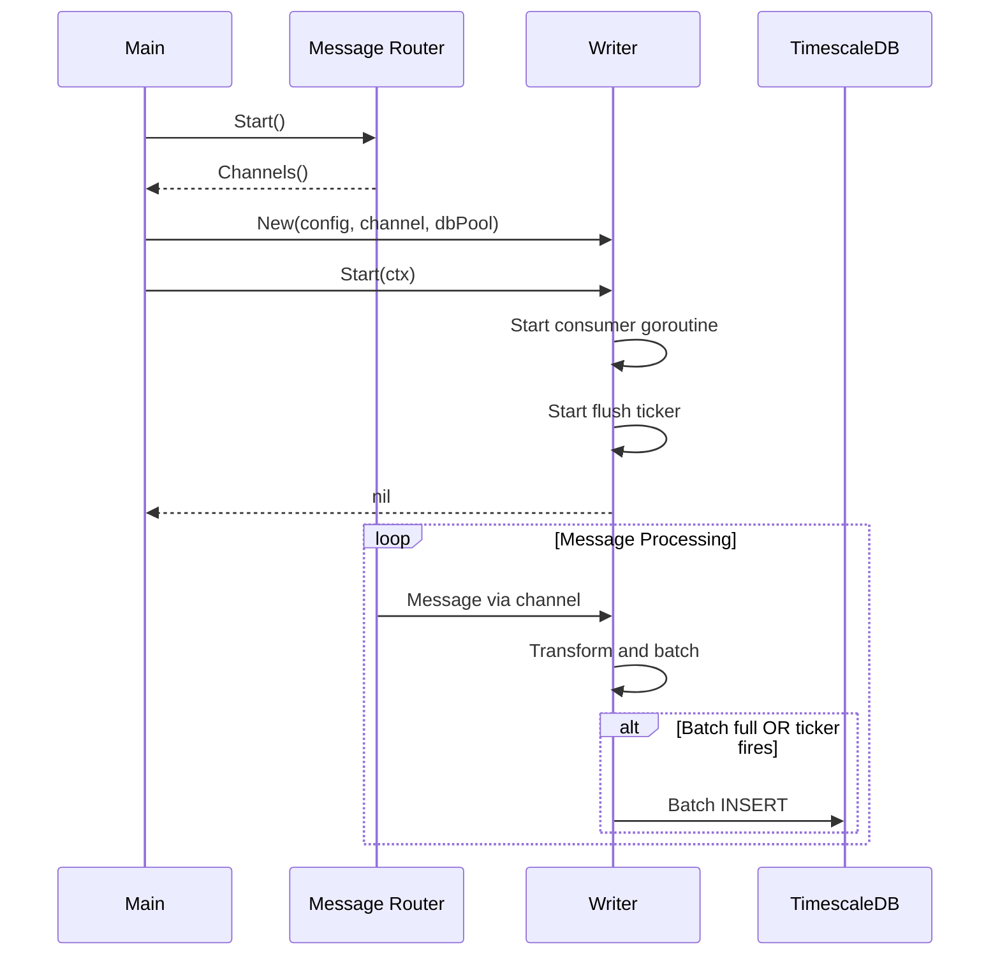
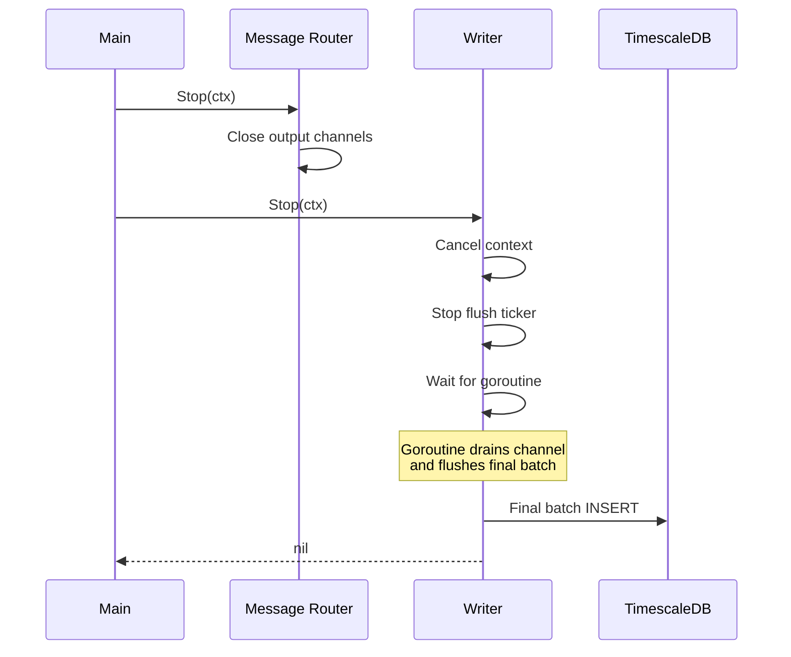

# Lifecycle

Startup and shutdown for Writers.

---

## Startup Sequence



### Constructor

```go
func NewTradeWriter(cfg WriterConfig, input <-chan TradeMsg, db *pgxpool.Pool) *TradeWriter {
    return &TradeWriter{
        cfg:   cfg,
        input: input,
        db:    db,
        batch: make([]tradeRow, 0, cfg.BatchSize),
    }
}
```

### Start

```go
func (w *TradeWriter) Start(ctx context.Context) error {
    w.ctx, w.cancel = context.WithCancel(ctx)
    w.flushTicker = time.NewTicker(w.cfg.FlushInterval)

    w.wg.Add(1)
    go w.run()

    return nil
}
```

**Startup order:**
1. Connection Manager starts (establishes WebSocket connections)
2. Message Router starts (creates output channels)
3. Writers start (receive channels, connect to DB, start goroutines)
4. Connection Manager subscribes to channels (triggers message flow)
5. Writers begin consuming immediately

---

## Shutdown Sequence



### Stop

```go
func (w *TradeWriter) Stop(ctx context.Context) error {
    // Signal goroutine to stop
    w.cancel()

    // Stop the flush ticker
    w.flushTicker.Stop()

    // Wait for goroutine with timeout
    done := make(chan struct{})
    go func() {
        w.wg.Wait()
        close(done)
    }()

    select {
    case <-done:
        return nil
    case <-ctx.Done():
        return ctx.Err()
    }
}
```

**Shutdown order:**
1. Message Router stops first (closes output channels)
2. Writers detect closed channels
3. Writers drain remaining messages
4. Writers flush final batch
5. Writers exit

---

## Consumer Loop

The main processing loop handles both message consumption and time-based flushing:

```go
func (w *TradeWriter) run() {
    defer w.wg.Done()

    for {
        select {
        case <-w.ctx.Done():
            // Drain and flush
            w.drain()
            w.flush()
            return

        case <-w.flushTicker.C:
            // Time-based flush
            if len(w.batch) > 0 {
                w.flush()
            }

        case msg, ok := <-w.input:
            if !ok {
                // Channel closed
                w.flush()
                return
            }

            // Transform and add to batch
            row := w.transform(msg)
            w.batch = append(w.batch, row)

            // Size-based flush
            if len(w.batch) >= w.cfg.BatchSize {
                w.flush()
            }
        }
    }
}
```

---

## Drain on Shutdown

When shutting down, drain any remaining messages from the input channel:

```go
func (w *TradeWriter) drain() {
    for {
        select {
        case msg, ok := <-w.input:
            if !ok {
                return
            }
            row := w.transform(msg)
            w.batch = append(w.batch, row)
        default:
            return
        }
    }
}
```

---

## Flush Triggers

| Trigger | Condition | Purpose |
|---------|-----------|---------|
| Size-based | `len(batch) >= BatchSize` | Prevent unbounded memory growth |
| Time-based | `FlushInterval` ticker fires | Ensure timely writes during low volume |
| Shutdown | Context cancelled or channel closed | Persist all buffered data |

---

## Snapshot Writer Lifecycle

Unlike channel-based writers, Snapshot Writer is **synchronous**:
- No input channel - Snapshot Poller calls `Write()` directly
- No consumer goroutine - each call blocks until insert completes
- No batching - each snapshot is inserted immediately
- Start/Stop only manage DB connection

```go
// Called by Snapshot Poller for each market snapshot
func (w *SnapshotWriter) Write(snapshot RESTOrderbookSnapshot) error {
    row := w.transform(snapshot)
    return w.insert(row)
}

func (w *SnapshotWriter) transform(snap RESTOrderbookSnapshot) orderbookSnapshotRow {
    yesBids := priceLevelsToJSONB(snap.YesBids)
    noBids := priceLevelsToJSONB(snap.NoBids)

    // Derive asks from opposite bids
    yesAsks := deriveAsksFromBids(snap.NoBids)
    noAsks := deriveAsksFromBids(snap.YesBids)

    return orderbookSnapshotRow{
        SnapshotTs:  snap.SnapshotTs,
        ExchangeTs:  0,  // REST has no exchange timestamp
        Ticker:      snap.Ticker,
        Source:      "rest",
        YesBids:     yesBids,
        YesAsks:     yesAsks,
        NoBids:      noBids,
        NoAsks:      noAsks,
        BestYesBid:  extractBestPrice(snap.YesBids),
        BestYesAsk:  extractBestAskFromBids(snap.NoBids),
        Spread:      calculateSpread(snap.YesBids, snap.NoBids),
        SID:         0,  // REST has no subscription ID
    }
}
```

**Lifecycle:**
1. Main creates Snapshot Writer with DB pool
2. Snapshot Poller receives Snapshot Writer reference
3. Every 15 minutes, Snapshot Poller:
   - Fetches orderbook via REST API for each market
   - Calls `Write()` synchronously (blocks until insert completes)
4. On shutdown, Snapshot Poller stops polling, Snapshot Writer connection pool is closed
