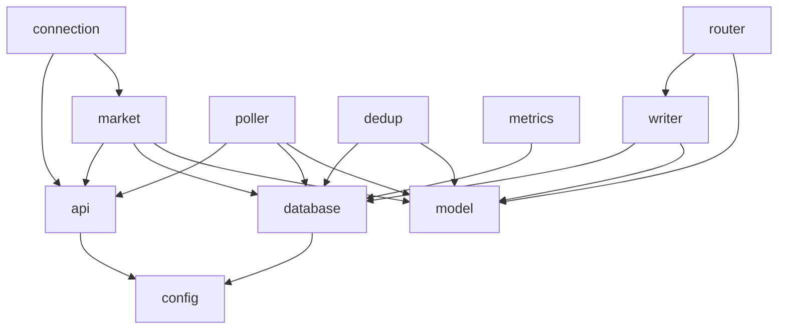

# Internal Packages

This directory contains all internal packages for the Kalshi Data Platform. These packages are not intended for external use.

## Package Overview

| Package | Description |
|---------|-------------|
| `api` | Kalshi API client (REST + WebSocket) |
| `config` | YAML configuration loading with env var substitution |
| `database` | PostgreSQL and TimescaleDB connection pools |
| `market` | Market Registry - discovers and tracks markets |
| `connection` | Connection Manager - WebSocket pool (150 connections) |
| `router` | Message Router - routes messages to writers |
| `writer` | Batch writers for all data types |
| `poller` | Snapshot Poller - REST API backup polling |
| `dedup` | Deduplicator - cross-gatherer deduplication |
| `metrics` | Prometheus metrics exposition |
| `model` | Shared data types (Market, Trade, OrderbookDelta, etc.) |
| `version` | Build-time version information |

## Dependencies

